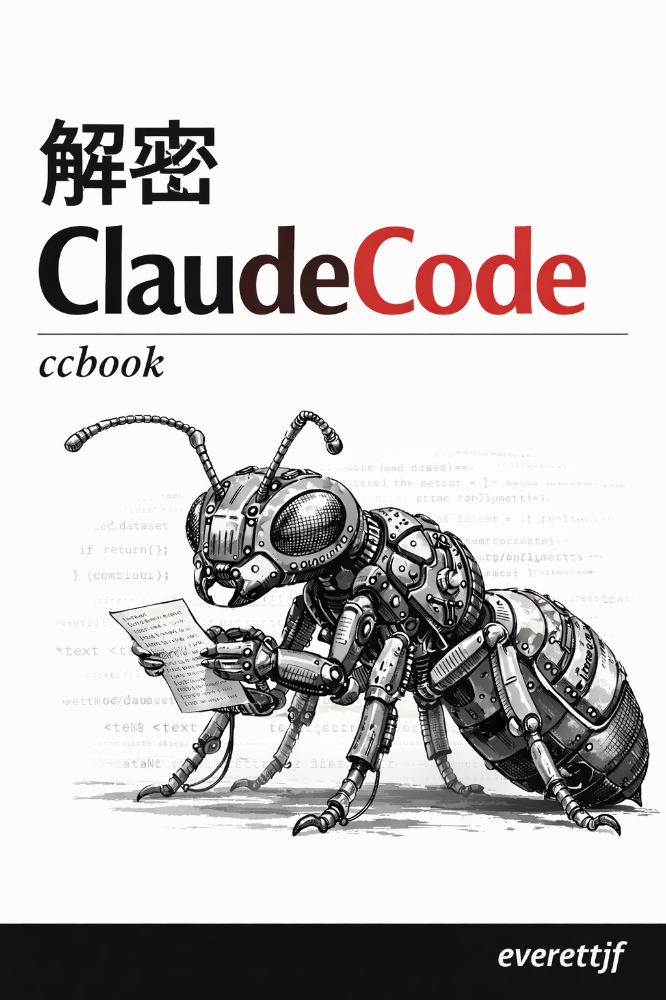

# 解密 Claude Code

## 一个 AI 编程助手的源码之旅

 

**作者：everettjf**

*使用 Claude Code 分析泄露源码*

 

深度解析 50 万行代码背后的架构与设计思路

 

30 章正文 | 3 个附录 | 150+ 代码示例 | 40+ 架构图

 

<a class="dl-btn dl-start" href="preface.html">开始阅读</a>
<a class="dl-btn dl-pdf" href="https://github.com/ccbook/ccbook.github.io/releases/latest">下载 PDF</a>
<a class="dl-btn dl-epub" href="https://github.com/ccbook/ccbook.github.io/releases/latest">下载 EPUB</a>
<a class="dl-btn dl-epub" href="https://github.com/ccbook/ccbook.github.io">源码</a>

 

当前版本：{{VERSION}}

访问 [https://ccbook.github.io](https://ccbook.github.io) 获取最新版

